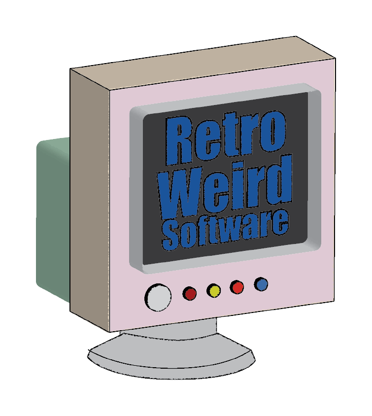

# Recent Digital Media Project

I am currently taking a digital media course. Here are some of the logos I have made for the class using Adobe Illustrator. These logos are for a fictional company, RetroWeird Software

[<Previous](Hobbies.md) [Next>](RecentCodingProject.md)
